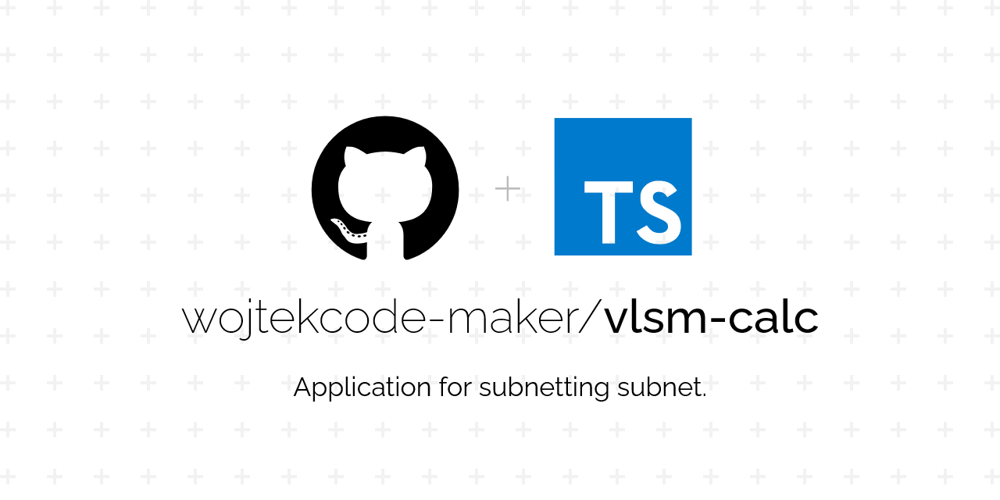
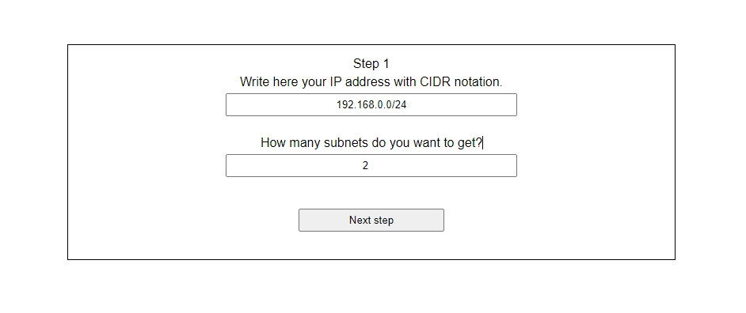
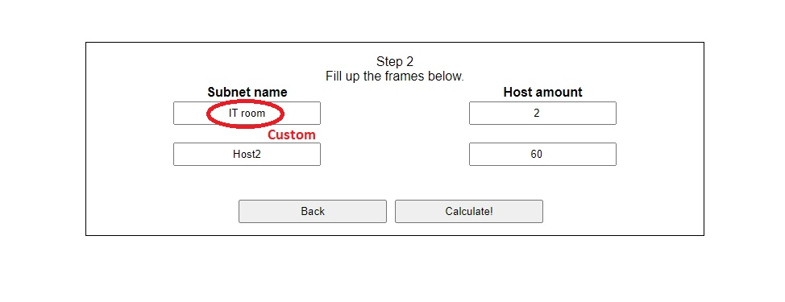
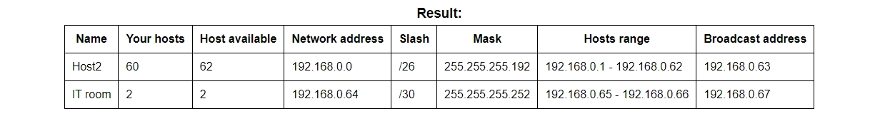

# VLSM CALCULATOR APP.


## Contents:
* [Introduction](#introduction)
* [Technologies](#technologies)
* [How to run](#how-to-run)
* [Screenshots](#screenshots)

## Introduction
The application was created to facilitate subnets sharing using the VLSM technique.

## Technologies
Project is created with:
* Express.js
* Express Handlebars
* Typescript
* Cookie-parser
* SCSS

## How to run
```
$ cd ../vlsm-calc-release
$ npm install
$ npm start
```

## Screenshots
* In first step user should provide IP addres with CIDR notation and amount of subnets which the user wants to receive.



* In second step user can set custom name for the subnet or stay with default. Pass the number of users in each network is required.



* Step 3 - summary. There is a result of user data.

